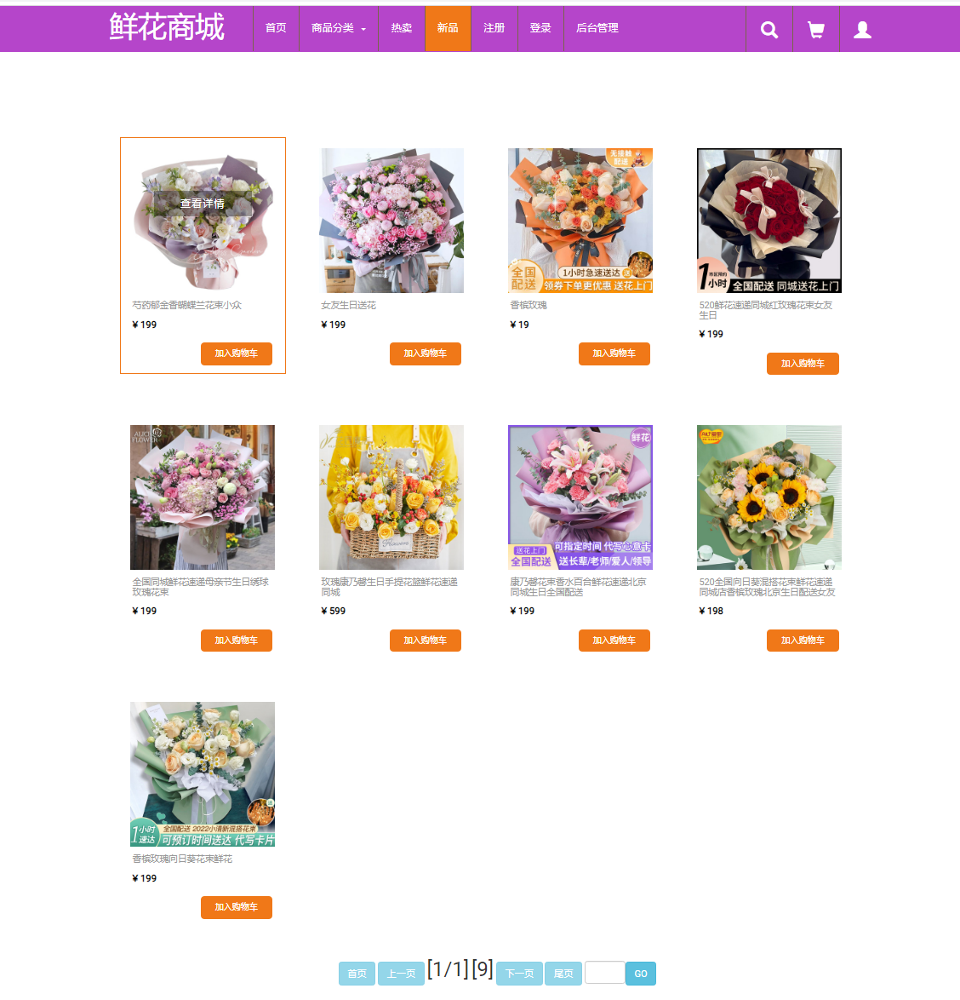

# 项目名称
# 基于 java+ssm+mysql实现的商城项目
基于java+ssm+maven+mysql实现的商城项目，ssm商城项目（期末大作业，毕业设计） java商城，ssm商城，jsp商城，mysql商城， java商城，servlet商城，jsp商城，mysql商城。 java，servlet商城，jsp商城，mysql商城

## 安装与下载【idea与eclipse】
## 加QQ：2108657327 发项目源代码！！ 可以帮助远程调试运行好 【源码+数据库+远程调试】

## 特性/功能

java+ssm+mybatis+mysql实现的商城项目

期末大作业，毕业设计

mvc 模式   

具体功能如下截图：
  登录，注册，购物车，商品收索，订单，支付，商品管理，订单管理，购物车管理，分类管理等
  

## 安装与下载【idea与eclipse均可运行】
### 加QQ：2108657327 免费获取项目源代码！！！ 
